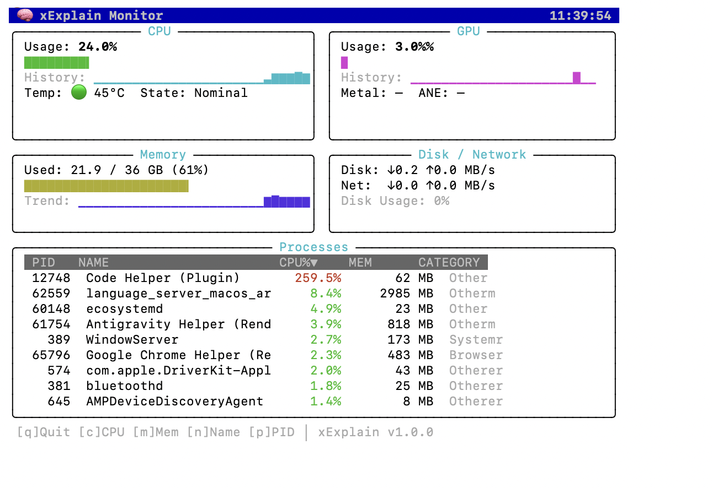
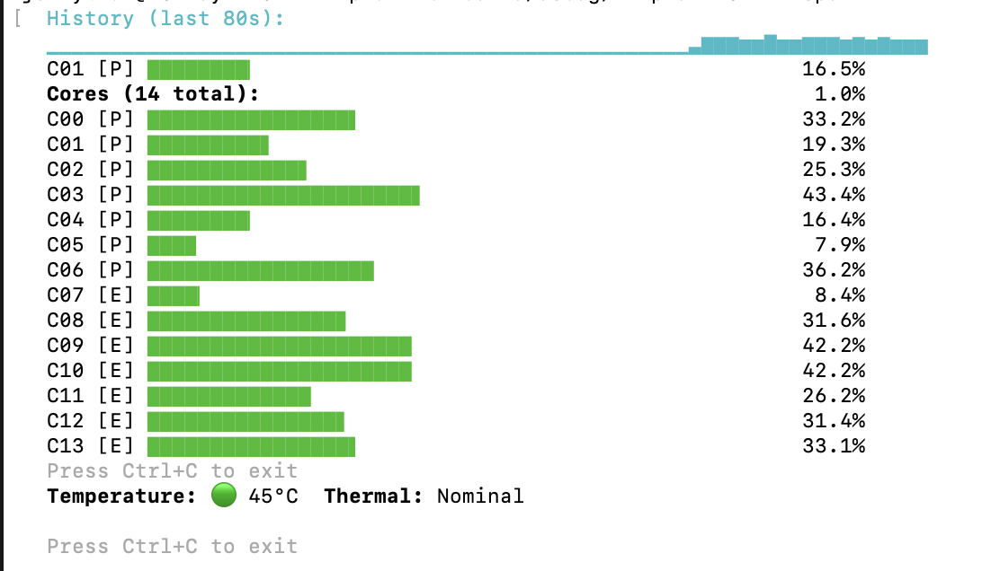
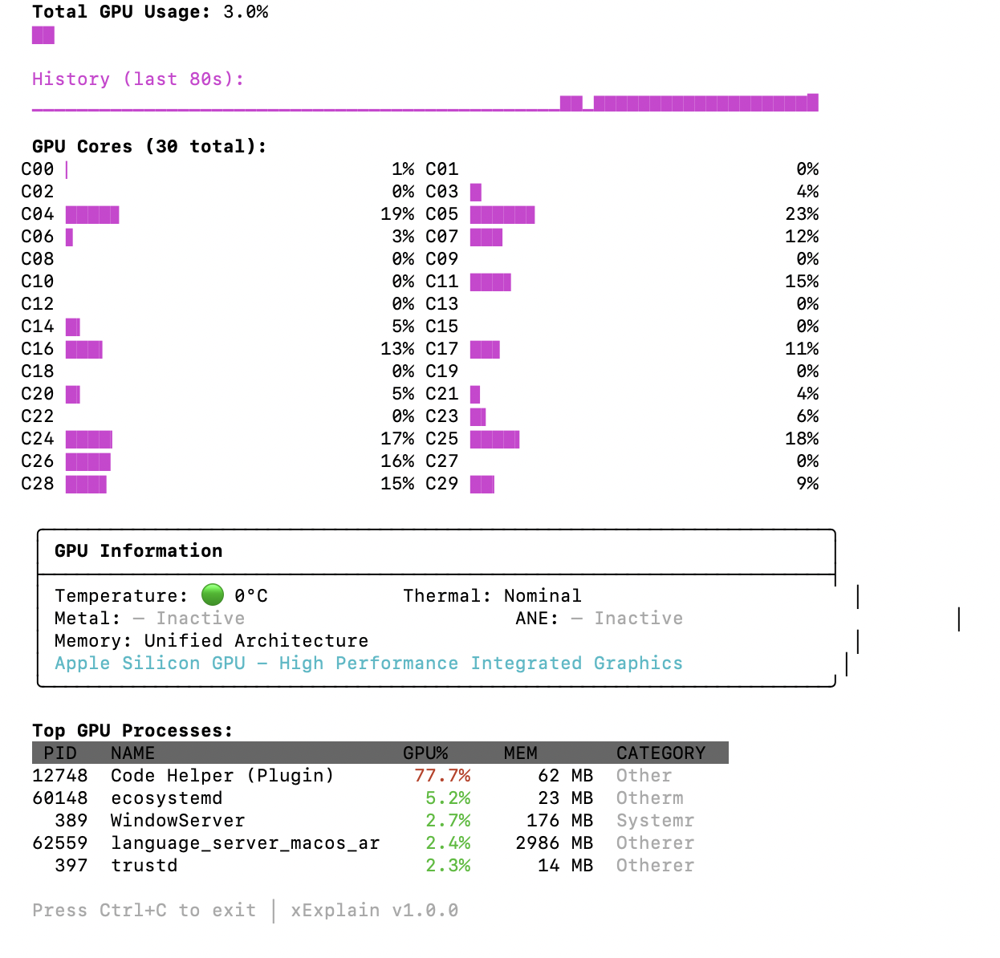

# xExplain

> 🧠 System Intelligence Library & CLI for macOS - The "System Brain"

**xExplain** is a Swift Package that provides intelligent system analysis with **counterfactual reasoning**. It's the shared core for the xInsight ecosystem (xInsight, xInsight Dev, xThermal).

## ✨ Showcase

### Full System Monitor (btop-like)


### CPU Monitor - Per-core Performance


### GPU Monitor - Apple Silicon 30 Cores


---

## 🚀 Quick Install

```bash
# Clone and build
git clone https://github.com/xdev-asia-labs/xExplain.git
cd xExplain
swift build -c release

# Run
.build/release/xExplain-CLI --monitor
```

### Homebrew
```bash
brew tap xdev-asia-labs/tap
brew install xexplain
```

---

## 🖥 CLI Commands

```bash
xexplain                  # Run once - quick system analysis
xexplain --monitor, -m    # Full system monitor (btop-like)
xexplain --cpu            # CPU detailed monitor with per-core bars
xexplain --gpu            # GPU detailed monitor with all cores
xexplain --watch, -w      # Continuous text monitoring mode
xexplain --json, -j       # Output in JSON format
xexplain --interval N     # Set update interval (seconds)
xexplain --version, -v    # Show version
xexplain --help, -h       # Show help
```

---

## 📦 Library Installation

### Swift Package Manager

```swift
dependencies: [
    .package(url: "https://github.com/xdev-asia-labs/xExplain.git", from: "1.0.0")
]
```

---

## 🔧 Key Features

| Feature | Description |
|---------|-------------|
| 🔮 **Counterfactual Analysis** | "What if I quit this app?" → "CPU will drop by 31%" |
| 📊 **Confidence Scoring** | Know how reliable each insight is (0.0 - 1.0) |
| 👤 **Audience Targeting** | Consumer, Developer, Power User insights |
| 🌡 **Thermal Forecasting** | Predict when throttling will occur |
| 📈 **Real-time Metrics** | CPU, GPU, Memory, Disk, Network monitoring |
| 🎮 **GPU Core Detection** | Auto-detect and display all GPU cores |

---

## 💻 Library Quick Start

```swift
import xExplain

// Get the engine
let engine = ExplainEngine.shared

// Register rules
engine.registerRules(for: .developer)
engine.registerRules(for: .power)

// Analyze system state
let insights = engine.analyze(
    metrics: myNormalizedMetrics,
    processes: myProcessSnapshots
)

// Quick queries
if let cpuInsight = engine.whyCPU(metrics: m, processes: p) {
    print(cpuInsight.explanation)
    if let cf = cpuInsight.counterfactual {
        print("If you \(cf.action): \(cf.expectedOutcome)")
    }
}

// Thermal forecast
if let forecast = engine.thermalForecast(currentMetrics: metrics) {
    if forecast.willThrottle {
        print("Throttle in ~\(forecast.estimatedMinutes!) minutes")
    }
}
```

---

## 🏗 Architecture

```
xExplain/
├── Sources/
│   ├── xExplain/                    # Core library
│   │   ├── Core/
│   │   │   ├── ExplainEngine.swift        # Main analysis engine
│   │   │   ├── CorrelationEngine.swift    # Metric-process correlations
│   │   │   ├── AnomalyDetector.swift      # Statistical anomaly detection
│   │   │   ├── CounterfactualAnalyzer.swift
│   │   │   └── ConfidenceScorer.swift
│   │   ├── Models/
│   │   │   ├── ExplainInsight.swift
│   │   │   └── SystemModels.swift
│   │   └── Rules/
│   │       ├── Consumer/            # Basic insights
│   │       ├── Developer/           # Dev-focused insights
│   │       └── Thermal/             # Power user insights
│   └── xExplain-CLI/                # CLI Tool
│       ├── main.swift
│       └── TerminalUI.swift         # btop-like UI
├── Tests/
├── homebrew/                        # Homebrew formula
└── .github/workflows/               # CI/CD
    ├── ci.yml
    └── release.yml
```

---

## 📋 Built-in Rules

### Consumer (Always Active)
| Rule | Trigger | Description |
|------|---------|-------------|
| CPU Saturation | CPU > 80% | Identifies top CPU consumers |
| Memory Pressure | Memory pressure != normal | Finds memory hogs |
| I/O Bottleneck | Disk I/O > 100 MB/s | Explains high disk activity |
| Thermal Throttling | Thermal state serious/critical | Explains overheating |

### Developer (Register with `.developer`)
| Rule | Trigger | Description |
|------|---------|-------------|
| Core Imbalance | P-cores idle, E-cores busy | Single-thread bottleneck |
| Dev Loop | CPU spikes + dev tools | Hot reload loop detected |
| I/O Amplification | Reads >> Writes | File watcher overhead |
| ML Workload | High CPU + no Metal/ANE | AI fallback to CPU |

### Power User (Register with `.power`)
| Rule | Trigger | Description |
|------|---------|-------------|
| Silent Throttle | Frequency reduced | Apple's hidden throttling |
| Energy Inefficiency | Many low-CPU wake-ups | Battery drain pattern |
| Thermal Forecast | Rising temperature trend | Predict throttling time |

---

## 🔬 Counterfactual Analysis

The key differentiator of xExplain:

```swift
struct ExplainInsight {
    let symptom: String           // "High CPU"
    let rootCause: String         // "Docker using 70%"
    let explanation: String       // Human-readable
    let confidence: Double        // 0.0 - 1.0
    let counterfactual: Counterfactual? // 👈 Key!
}

struct Counterfactual {
    let action: String            // "Quit Docker"
    let expectedOutcome: String   // "CPU will drop to ~30%"
    let quantifiedImpact: String? // "-40%"
    let confidence: Double        // 0.85
    let timeToEffect: TimeInterval? // 2.0 seconds
}
```

---

## 🤝 Contributing

1. Fork the repository
2. Create your feature branch (`git checkout -b feature/amazing-feature`)
3. Commit your changes (`git commit -m 'Add amazing feature'`)
4. Push to the branch (`git push origin feature/amazing-feature`)
5. Open a Pull Request

---

## 📄 License

This software is free to use for personal and commercial purposes.  
**Redistribution for commercial gain is prohibited.**

See [LICENSE.md](LICENSE.md) for details.

---

## 🔗 Links

- **xInsight**: Full macOS monitoring app (uses xExplain)
- **xInsight Lite**: Free version for basic monitoring
- **xdev.asia**: https://xdev.asia

---

Made with ❤️ by [xdev.asia](https://xdev.asia) © 2026
